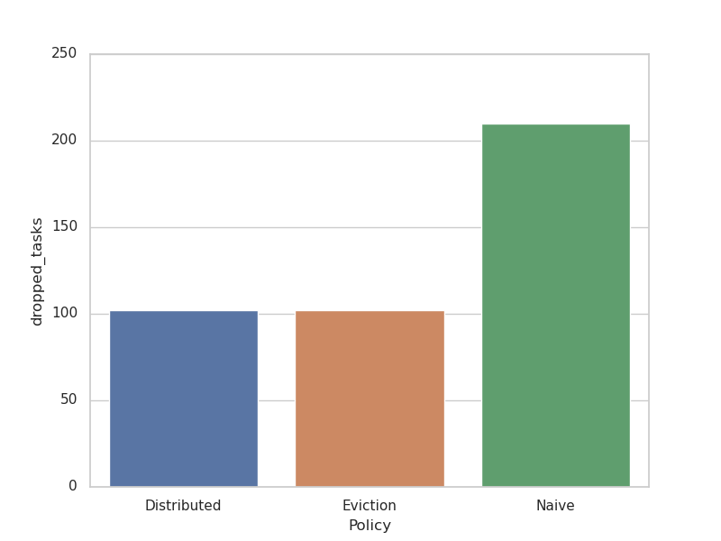

For our Big Data and Machine Learning final project we developed a scheduler for edge computing in healthcare.
# Motivation

Fog computing, also called Edge Computing, is intended for distributed computing where numerous
"peripheral" devices connect to a cloud. With the explosion of IoT devices and widespread availability
of internet in the past decade, there has been a push to move computation to devices on the edge. While cloud computing
offers several advantages wih respect to elasticity and scalability, the distance between the edge devices and
the cloud gives rise to latency issues. This becomes a bottleneck in IoT applications
where results to computations are necessary in real-time (like in the case of disaster management
and content delivery applications.) Service Level Agreements (SLAs) may also impose processing at
locations where the cloud provider does not have data centers. Latency and other limitations have
been discussed in this [paper](https://www.researchgate.net/profile/Rodolfo-Milito/publication/235409978_Fog_Computing_and_its_Role_in_the_Internet_of_Things/links/0deec531f19946228c000000/Fog-Computing-and-its-Role-in-the-Internet-of-Things.pdf).

Resource management and task scheduling in Fog Computing have garnered interest especially since there has been a
rise in demand for quality of service in IoT devices. As with the cloud architecture, there cannot be a one size
fits all solution for scheduling in fog computing. [Matrouk et al.](https://www.atlantis-press.com/journals/ijndc/125951775/view) provide an extensive survey of existing fog schedulers.
[Mouradian et al.](https://arxiv.org/pdf/1710.11001.pdf) explores fog computing and enumerates areas of
further research.

### Scenario

Healthcare has been revolutionised by IoT devices, from making monitoring patient vitals simpler
to early detection of deadly diseases. We will design a scheduler to detect emergencies in healthcare based on vitals
monitored by IoT devices. It is crucial that we optimise the device to provide high priority emergencies with timely
responses.

### Constraints
* The scheduler should be optimised for high priority tasks.
* Scheduling latency should be in the order of milliseconds.

### Architecture

The edge architecture we propose is a n-level hierarchical architecture which will consist of edge devices like
sensors (Ex: ECG, temperature sensor, blood pressure sensor) at the
lowest level and fog devices which perform computation and decision-making at the subsequent higher level. The top level will
eventually be the cloud server where data and records to be stored can be sent and maybe heavy analytics based research can be
done. [HealthEdge](http://www.cs.virginia.edu/~hs6ms/publishedPaper/Conference/2017/HealthEdge-BigData2017.pdf) talks about the
edge architecture in healthcare systems.

The individual patient level monitoring and welfare assistance will be performed by the fog devices in the intermediate
levels as quick response(low latency) is paramount. These fog devices will schedule tasks on a priority based approach with
higher priority for emergency scenarios.

Each of the devices will have its own constraints like their internal processing latency and so on. These
constraints of the devices will be modelled in the simulator where each of the devices will be assigned specific values for
the relevant constraints like latency, power usage and so on. We assume that the constraints such as latency
, network bandwidth for our devices will be modelled according to the constraints specified by  [Shukla et. al
](https://journals.plos.org/plosone/article?id=10.1371/journal.pone.0224934).

### OUTLINE
-   How does cloud scheduling differ from edge scheduling?
    - QoS - power efficiency , latency
    - Latency
    - Limited resources
    - Fog devices can have unpredictable availability

### Architecture:
  We modelled a 3 level edge-architecture which consists of edge devices like sensors (Ex: ECG, temperature sensor, blood pressure sensor) at the
  lowest level and fog devices which perform computation and decision-making at the subsequent higher level. The top level consists of the cloud server where heavy analytics based research can be conducted.
  
  
  

- **Tasks** :

Task type  | Description | Scheduled at
---------|----------|----------
Emergency| Critical health level | Edge only
Privacy | Patient data | Edge only
Cloud analytics| Resource intensive analytics task | Cloud only
Cloud or edge station| Monitoring message | Cloud or edge

- **Trace generation** : 
  - 30% chance that high proportion of emergency tasks will occur.(Bernoulli)
  - Probabilistic distribution of task types and resource requests for each type.
  - Freqency of messages from each edge sensor varied with probabilistic distribution  

- Resource allocation : 
  - Naive FCFS : Resources are allocated on first come first serve basis
  - Naive Priority : Resources are allocated based on the priority of the tasks. Higher priority will be allocated resources before lower priority task if they are executable at the same time.  
  - Priority based with Eviction : If an emergency task arrives and there are insufficient resources in the device that can be allocated, we dellocate resources for lower priority tasks and allocate it to the emergency task.

- Task placement policy : 
  - Edge devices only (Naive) : 
    - Tasks are scheduled only on edge device with priority scheduling
    - All tasks that require resources more than total resources on the device on the device are dropped.
  - Cloud only 
    - All tasks are allocated completely on cloud. 
    - Latency contribution is primarily from network latency to send and receive tasks. 
  - Distributed with probing and cloud offload
    - If a lower priority task arrives at the device, and all the resources are being used by higher priority task, the task is offloaded to a nearby fog device.
    - 3 Probes are sent to nearby fog devices, task is scheduled on device with lowest resource utilization. We add a penalty on the latency for every offload to nearby edge device. 
    - All tasks that require more resources than total resources on the device on the device that cannot be scheduled on cloud are dropped.
    - Tasks that can be scheduled on cloud are offloaded to the cloud. 
    - Priority scheduler on edge; FCFS on cloud
  - Cloud offload with eviction :
    - If an emergency task arrives at the device, and all the resources are being used by lower priority tasks, we evict the running task (and place it back into the queue) and schedule the emergency task.
    - All tasks that require more resources than total resources on the device on the device that cannot be scheduled on cloud are dropped.
    - Tasks that can be scheduled on cloud are offloaded to the cloud.
    - Priority scheduler with eviction on edge; FCFS on cloud

- What we have not modelled : 
    - network usage/ network latency 
    - multiple resource allocations 

### Performance evaluation

- Task Distribution  
  
   

- Completion time  
  Completion time for the trace is given below. Distributed mode completes at 254, Eviction at 311 and naive at 313.
    
  
- Average task waiting time  
  Lowest task waiting time is achieved by the distributed model. 
    

- Emergency task wait time  
  Lowest emergency wait time at the device is achieved by the eviction policy. Distributed comes second followed by the naive policy.
    

- Dropped tasks  
  The naive implementation drops a lot more taks since it does not offload resource intensive tasks to cloud. 
    

- CPU Utilization  
###Tradeoffs
- Why schedule at the edge?
    - Data locality
    - Faster response times (Less network hops and better QoS)

- Why should you not combine distributed with an eviction policy?
    - Network utilization would be high (You could reduce number of probes sent out, but it would still be high).
    - Network congestions could lead to delays for emergency tasks to reach the fog device.
  
- Limitations of our model
    - Network usage/ bandwidth : Modelling the network usage and bandwidth would provide a more complete picture of the scenario. 
    - Power consumption : While have statistics for CPU utilization, we have not limited scheduling tasks on edge devices based on the cpu utilization.
      Power consumption is important for QoS (Lower power consumption implies better battery life). 
    - Since we have modelled this on a small trace, the difference in times are small. As rthe model scales, so does the differnce in latencies

- If we had more time,
    - Design hybrid policy - Identify when it is optimal to switch between eviction and distributed policies
    - Model network bandwidth and latencies
    - Generate larger traces and optimise code to run for the same.     
    - Explore swarm optimisation
  
Repo :  https://github.com/1um0s/edge-scheduler-sim.git

[comment]: <> (Needs cleanup)