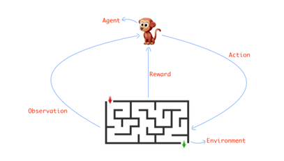
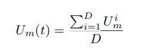
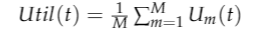
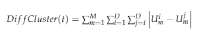
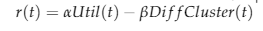
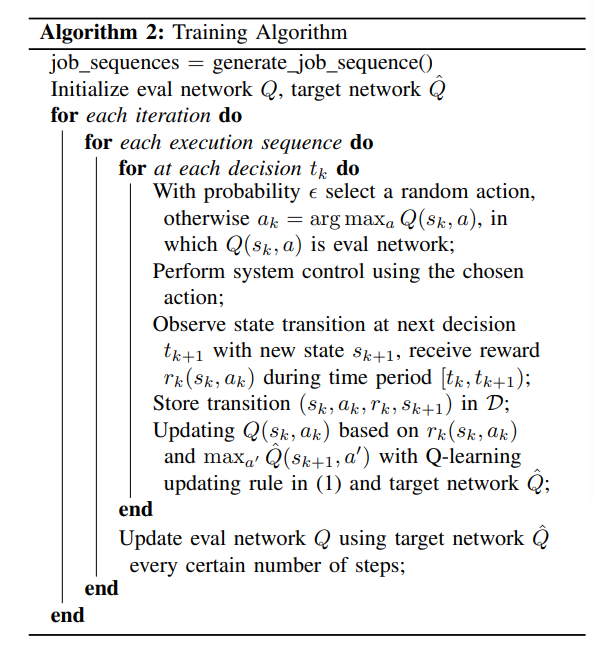
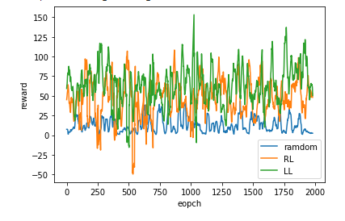
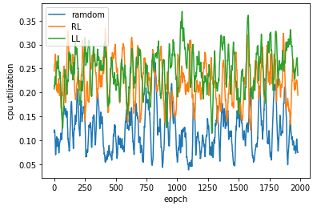

# Introduction

We developed a customized scheduler policy using Reinforcement Learning based on an existing paper, <cite>[RLSK: A Job Scheduler for Federated Kubernetes Clusters based on Reinforcement Learning][1]</cite>.  We also designed a Q Learning model based on information from Kubernetes API and job requirements. The status of the clusters and the requirement of the job are state features as input, and the model decides how to allocate jobs to different clusters or push it later. A metric is also designed to analyze whether the decision is actually a “good choice”. 

[1]: https://conferences.computer.org/cpsiot/pdfs/IC2E2020-6j9eixwcPIo0tUoMnoCahH/109900a116/109900a116.pdf

# Motivation
The default algorithm of kube-scheduler can help us in most cases, but sometimes people need to develop their own scheduling policy and change the configurations for specific projects in different circumstances. This process involves lots of repeated work done manually to get the optimized solution. To improve the efficiency of the whole process, machine learning models are considered to assist making decisions when scheduling. The status of the clusters and the requirement of the job could be some state features as input, and the model will decide how to allocate the resources to those jobs. A metric will be designed to analyze whether the decision is actually a “good choice”. Reinforcement Learning is one of the models that could explain the problem well.

# Method
Reinforcement learning is a machine learning algorithm that enables agents to learn actions through continuous trials and improve action choice based on feedback from the environment. It’s different from the traditional machine learning model that we evaluate the result using labels and calculate errors like Mean Square Error. For Reinforcement Learning, we are evaluating our action policy according to the reward received from the environment. Those rewards could be seen as a signal to analyze whether the current action is correct.

It should be noticed that we are maximizing the cumulative reward of the agent, instead of a single one. This will constrict the policy in cases it will get extreme high rewards in certain cases and get low rewards in other cases. So before choosing an action, the agent needs to consider how expectation of reward may change after that. Usually, Reinforcement Learning consists of 4 parts, including agent, action, reward and environment as shown below. The observation sometimes indicates a mathematics equivalent or simplified model of the environment.

<cite>[ ][2]</cite>

[2]: https://conferences.computer.org/cpsiot/pdfs/IC2E2020-6j9eixwcPIo0tUoMnoCahH/109900a116/109900a116.pdf

We apply a reinforcement learning model to job scheduling since its attributes fit the features of RL well. Our job scheduler could be seen as an agent, which will decide how to allocate resources to incoming jobs and check the status of the clusters (observation). There will be some data about the load of the cluster and description of the job (environment). We will also define a reward function to consider both resource usage and balance between clusters in the later part.

## Environment
We define some environment state variables in this part to describe the current situation. We express the state as a one-dimensional vector as [SC, SJ]. Sc represents the state of cluster, and in this problem we set it as the usage ratio of different resources. Sc will float between 0 and 1, as mentioned before as ratio. Obviously, we will have multiple resources in one cluster, including CPU and memory. So Sc will also be a one dimensional vector, representing usage ratio for different resources. For an M cluster consisting of N kinds of resources for each one, we will get Sc with length of N+M.

The definition Sj will be more complicated compared with Sc. First we extract similar features from incoming jobs, including required usage ratio for different resources. Similarly, there will be N values for N resources. Other than that, we take one more value: the expected run time of the job t. Thus the length of Sj will be N+1.
Therefore, if we have M clusters and N resources, the environment state could be simplified as:
S = [SC,SJ]
  = [SC11+…SC1N+…SCMN+SJ1+…SJN+t]

## Action
For a traditional job scheduler, we need to allocate resources and clusters to the job. In this project, we simplify the problem into a base case, to test the potential application of Reinforcement Learning in this area. So here we only need to choose which cluster we want to place the job on. Thus we define a list with length of M, where M is the total number of clusters. This list will contain M boolean values, and the one with true will indicate the cluster the agent chooses.

## Reward
We use a similar idea from the original paper that our scheduler not only focus on the total usage of the total resources, but also try to maintain the balance between different clusters, minimizing the difference and avoiding problems caused by single cluster resource shortage. Usually, these two ideas seem to be contractive, and we need to construct a reward function that could combine them together.
We define the utilization of cluster m having N resources as:

The average utilization could be represented as:

The difference between clusters could be expressed as:

Our reward is a linear combination of utilization and difference:

Here we introduce alpha and beta to scale those two parts and try to make one of them more important in some cases.

# Implementation
Q learning is an algorithm used to calculate the expected reward Q (a, x) where a is the action and x is the environment state. It should be noticed that we are looking for optimal action and has maximum long-term reward. We need to train the agent though multiple iterations for exploring and learning the best action decision. The updating equation is:
Here we extend the idea to neural networks, since it is a better representation of unknown functions. Instead of having a Q table, we replace it with a deep neural network, which works well in continuous space. The detailed training iteration is shown below, which is same as algorithm 2 in original paper:

In our initial proposal, we plan to run our experiments on multiple CloudLab nodes. But because of the complexity of the deployment of the cluster and Kubernetes, we decided to run our scheduler on a local virtual cluster which is built with the Muti-node mode of Minikube. Our cluster has two nodes and each of them is assigned one cpu core and 1GB of memory. We mainly use the python client library of Kubernetes to write our scheduler. Since our algorithm part is written in Pytorch and we need to use a pre-trained model in our scheduler, writing in python will make saving and loading our model easier. 

The overall pipeline of our scheduler is as follows. 
* The scheduler pod will run an infinite loop with a specific Watch looking for the creation events. If a new pod is created, the scheduling logic will be triggered. 
* We extract a list of nodes which are ready in the cluster. We do not need to filter out the node with limited resources, since it will be resolved in the model.
* We get the cpu usage and memory usage of the nodes in the list and the amount of resource required by the incoming pod. Since the Python client library is still under development, there is no specific API. We need to iterate resource usage metrics through "metrics.k8s.io" and get the amount of resource currently used by a given node or a given pod. 
* The input to the model require the CPU usage and memory usage in percentage. However, the CPU usage in the metrics is in “n” (“nano cores” or “nanoCPU”) and the memory usage is in “Ki” (Kibibyte). We need to transform the data we get to the right format that can be used by the model.  
**Cpu %** = current nano-core usage / (cores * 1000000000) 
**Memory %** = current memory usage / total memory in Kibibyte
* We get the result (the node we want the pod to be scheduled in) from our pre-trained model and bind the incoming Pod to that node using “V1Binding” APIs.

Our scheduler can work on Kubernetes for most of the time. However, sometimes we may encounter a problem that although the resource is enough (checking using kubectl), the pod is unschedulable. We have not solved this problem yet. We think it may be caused by the Muti-node mode of Minikube (since it only released for a few months) or the fact that we miss some cases in our error handling. 

# Result
We design a simple experiment to test and evaluate the performance of our Reinforcement Learning model, here are some important parameters we have set:

**Number of clusters:** We use only two clusters here as a basic experiment, and we still expect more cluster experiments in future study to verify its effectiveness in large work load situations.
**Resources:** Similarly, we also only introduce CPU and memory here as only resources in the clusters.
**Job simulation distribution:** Our jobs are simulated though certain distributions as random variables. For both CPU and memory usage ratio, it follows uniform distribution from 0 to 0.1. As for the job duration, it is drawn between 1 and 10 uniformly.
**Reward function parameter:** We have tested different combinations of alpha and beta, and each of them will induce different results.

We have run 2000 iterations on random policy, least load policy and our reinforcement learning policy.Below shows the average reward obtained during the training process. We could see that on average it outperforms the random one, but still a little worse than the least load.

We also record the average memory utilization and CPU utilization during the training, and we could find similar results that reinforcement learning and least load are pretty closed, which proves the potential application of RL in job scheduler. 

# Lesson learned and future work

In the project, we learned about the scheduler of Kubernetes and how to use the python client library of Kubernetes to write our own program. Although the python library is still under development (which means little information on the Internet), we learned how each component of Kubernetes works with each other through reading the official document (some of them are unorganized). The project also makes us familiar with the procedure of reinforcement learning (Q-learning) through practice, which we did not experience before. 

We have shown that it’s possible to use reinforcement learning on job scheduling. Although our result does not beat the least load, it's better than baseline and has potential to be improved. There are parameters we could tune in the future, and more variables could be added into the state. Besides, we do not consider the action of pushing jobs backwards, which is essential in real application. This could be implemented by modifying the GameState() class in the future.

